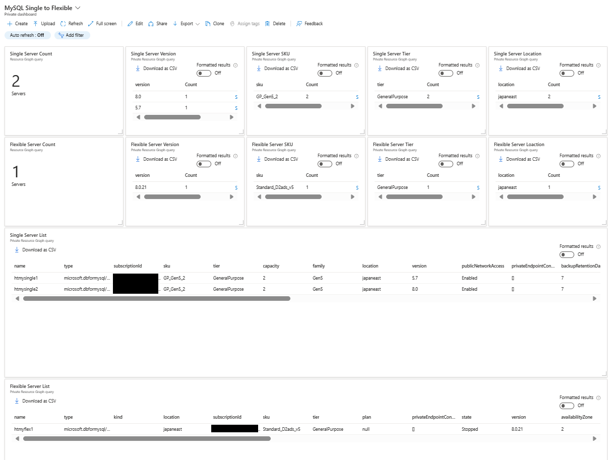
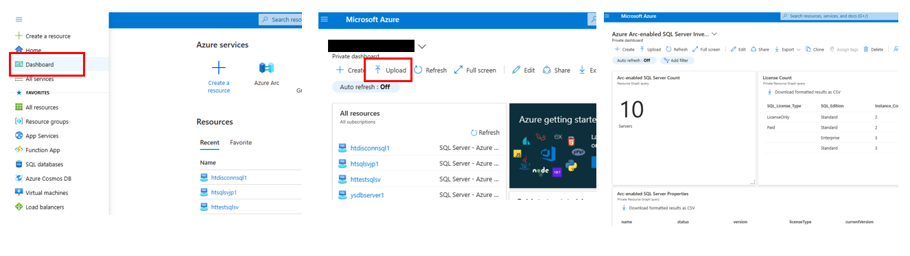

# Azure Database for MySQL Single Server & Flexible Server Inventory Dashboard

This sample dashboard enables you to easily manage your Azure Database for MySQL Single and Flexible Server.

It includes:

- Number of Single and Flexible Server
- MySQL Version
- SKU
- Service Tier
- Location
- Network Configurations
- Backup Configurations
- HA/DR Configurations
- etc

## How to install the dashboard

1. Download "azure-mysql-single-to-flexible-dashboard.json" file from this repository
2. Go to https://portal.azure.com
3. Ensure that you can access to the subscription that has Azure Arc-enabled Servers and SQL Servers
4. Go to dashboard, click "Upload", select "azure-mysql-single-to-flexible-dashboard.json"

